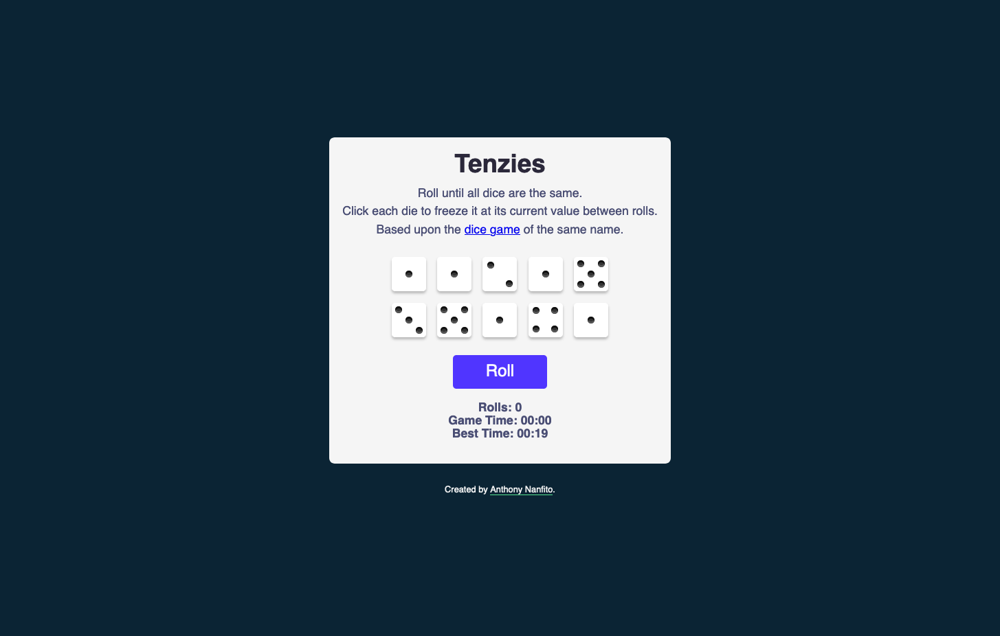
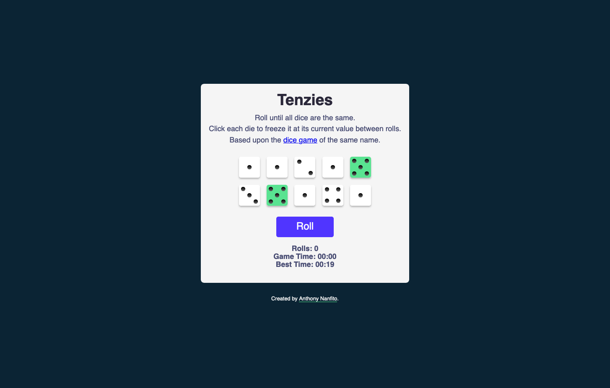
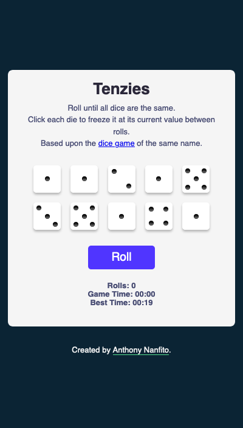
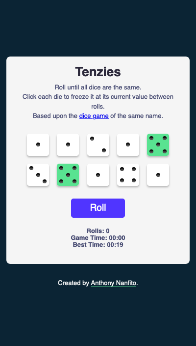

# Tenzies Clone

A clone of the popular dice game, Tenzies.

## Table of Contents 

- [Overview](#overview)
  - [Screenshot](#screenshot)
  - [Links](#links)
- [My Process](#my-process)
  - [Built with](#built-with)
  - [What I learned](#what-i-learned)
  - [Useful Resources](#useful-resources)
- [Author](#author)
- [Acknowledgments](#acknowledgments)

## Overivew

This project was introduced in Module 11 "React Basics" of [the Scrimba Frontend Career Path](https://scrimba.com/learn/frontend). It is a clone of the popular dice game, [Tenzies](https://ilovetenzi.com/), and is played the same way. 

The goal of the game is to roll the 10 dice until they are the same. During gameplay, players can set aside the number they are trying to reach -- this means these dice will not be rolled during the next roll. They then continue rolling and holding dice until all are the same number.

### Screenshot

#### Desktop





#### Mobile





### Links

A live version can be viewed at: https://tenzies-clone.netlify.app. 

## My Process

The bulk of this project was completed during follow-along tutorials, however, the following features were completed independently: 

- Ability to track time
- Store the player's best time in local storage
- Track the number of rolls
- Use CSS to add dice dots

### Built with

- HTML
- CSS
- JavaScript
- React JS

### What I learned 

This project packed a lot into it! It was a great opportunity to review key practices with React, such as `useState` and `useEffect`, but I think my biggest takeaway from this project was learning how to use CSS grid to create the dice dots.

As I learned from [this DEV.to blog post by Edwin](https://dev.to/ekeijl/creating-dice-using-css-grid-j4), the trick here is to use CSS grid with `grid-template-areas` and the `nth-child()` pseudo-selector to specify where the dots (or pips) will appear. This is because the dots on an actual dice fall into a 3x3 grid which makes CSS grid a great choice for displaying the dots.

Here's an excerpt of the CSS: 

```css
.die-face {
  box-shadow: 0px 3px 3px 0px rgba(0, 0, 0, 0.25); 
  padding: .20em;
  width: 45px;
  height: 45px;
  border-radius: 5px;
  cursor: pointer;
  display: grid;
  /* each area (or letter) will be taken by a dot */
  grid-template-areas: 
      "a . c"
      "e g f"
      "d . b";
  flex: 0 0 auto;
}

.pip {
  display: block;
  align-self: center;
  justify-self: center;
  width: 8px;
  height: 8px;
  border-radius: 50%;
  margin: 0;
  background-color: #333;
  box-shadow: inset 0 3px #111, inset 0 -3px #555;
}

/* these assign the dots to the appropriate grid areas */
.pip:nth-child(2) {
  grid-area: b;
}

.pip:nth-child(3) {
  grid-area: c;
}

.pip:nth-child(4) {
  grid-area: d;
}

.pip:nth-child(5) {
  grid-area: e;
}

.pip:nth-child(6) {
  grid-area: f;
}

/* this places the dot of the 3 and 5 die in the center */
.pip:nth-child(odd):last-child {
grid-area: g;
}
```

I found this solution to be particularly clever and helpful in completing the independent portions of the project. For a full explanation, I strongly encourage you to read [Edwin's post](https://dev.to/ekeijl/creating-dice-using-css-grid-j4) and check out the sandbox he provided at the end of the post. 

### Useful Resources

- [w3collective: Create a custom React stopwatch timer component](https://w3collective.com/react-stopwatch/) - This tutorial was helpful in setting up the time keeping portion of the project. 
- [Creating Dice Using CSS Grid by Edwin](https://dev.to/ekeijl/creating-dice-using-css-grid-j4) - This DEV.to post was immensely helpful in setting up the CSS for the dice dots. 

## Author

Thank you for reading about this project. If you'd like to connect with me for mentoring, collaboration, or employment opportunities, you can do so via the following links:

- <a href="mailto:msg.for.anthony.p6ht3@simplelogin.com?subject=Nice GitHub Project&body=Hey Anthony, I saw your GitHub project. Let's talk!">Email</a>
- [LinkedIn](https://linkedin.com/in/anthonynanfito)
- [Portfolio](https://ananfito.github.io)
- [Blog](https://ananfito.hashnode.dev)

## Acknowledgements

[Helen Chong's example of the game](https://github.com/helenclx/Tenzies-Game) was **very** useful to me in finding Ediwin's tutorial for the dice dots *and* for giving me the inspiration to use a `switch` statement within in the dice component. Thank you, Helen!
